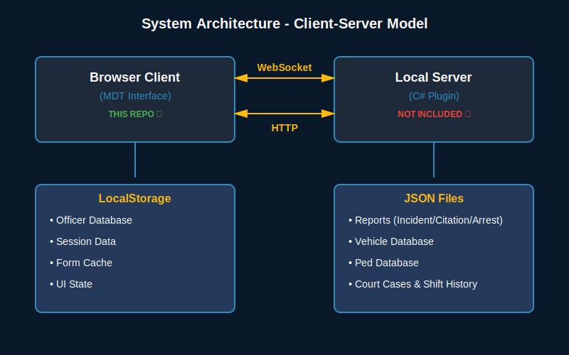

# LAPD MDT (Mobile Data Terminal) - Documentation

## Table of Contents
1. [Overview](#overview)
2. [System Architecture](#system-architecture)
3. [File Structure](#file-structure)
4. [Core Features](#core-features)
5. [Configuration](#configuration)
6. [Officer Management](#officer-management)
7. [Data Models](#data-models)
8. [UI Components](#ui-components)
9. [WebSocket Communication](#websocket-communication)
10. [Customization Guide](#customization-guide)
11. [Troubleshooting](#troubleshooting)

---

## Overview

The LAPD MDT (Mobile Data Terminal) is a comprehensive law enforcement management system designed for **GTA V singleplayer** using LSPDFR (Los Santos Police Department First Response). It provides officers with a Windows-style desktop interface for managing personnel, conducting searches, filing reports, and tracking shift activities.

> **⚠️ Important Note**: This repository contains **ONLY the web interface portion** (HTML/CSS/JavaScript files). The complete External Police Computer mod requires the **compiled RAGE Plugin Hook DLL** that interfaces with GTA V. This web interface will NOT work without the C# plugin component. For the full mod installation including the compiled DLL, download from the LCPDFR.com link below.
>
> This website was built based on the original EPC creator's (jullevistrunz) website code, with enhancements and modifications to improve functionality and user experience.

### Original Project
- **Original Author**: [jullevistrunz](https://github.com/jullevistrunz)
- **GitHub Repository**: [ExternalPoliceComputer](https://github.com/jullevistrunz/ExternalPoliceComputer)
- **Download Full Mod**: [LCPDFR.com](https://www.lcpdfr.com/downloads/gta5mods/scripts/45400-externalpolicecomputer/)

### What's Included Here
✅ **Web Interface Files** (this repository)
- HTML pages (MDT interface, search forms, reports)
- CSS stylesheets (UI styling, themes)
- JavaScript modules (frontend logic, window management)
- JSON configuration files

❌ **Not Included** (requires full mod download)
- **Compiled RAGE Plugin Hook DLL** (ExternalPoliceComputer.dll)
- C# source code for GTA V integration
- LSPDFR communication layer
- Game data extraction logic

### Key Technologies
- **Frontend**: HTML5, CSS3, Vanilla JavaScript
- **Backend**: WebSocket server for real-time updates
- **Data Storage**: LocalStorage (client-side) and JSON files (server-side)
- **UI Framework**: Custom Windows-inspired desktop environment

---

## System Architecture

### Client-Server Model



The LAPD MDT system operates on a client-server architecture where:
- **Browser Client** (included in this repo) provides the user interface
- **Local Server** (C# plugin - not included) handles game integration and data persistence
- **Communication** occurs via WebSocket for real-time updates and HTTP for data operations
- **Storage** is split between browser LocalStorage (temporary/session data) and server-side JSON files (persistent data)

### Component Breakdown

**1. Web Interface** (Included in this repository)
- Runs in browser (Chrome, Edge, Firefox)
- Provides UI for all MDT functions
- Communicates with C# backend via HTTP/WebSocket
- Stores temporary data in LocalStorage
 DLL** (NOT included - download full mod)
- **File**: ExternalPoliceComputer.dll (compiled plugin)
- Interfaces with GTA V via RAGE Plugin Hook
- Hosts local web server (default port 8080)
- Retrieves game data (peds, vehicles, location)
- Manages persistent data storage (JSON files)
- Bridges communication between game and web interface
- **Required**: Must be installed in GTA V/plugins folder
- Bridges communication between game and web interface
   - Form Cache                                   - Ped Database
```

### Application Layers
1. **Presentation Layer**: HTML/CSS UI components
2. **Business Logic**: JavaScript modules for each feature
3. **Data Access**: LocalStorage API and Fetch API
4. **Communication**: WebSocket for real-time data

---

## File Structure

```
EPC/
├── main/
│   ├── pages/                    # HTML page files
│   │   ├── index.html           # Main MDT window
│   │   ├── pedSearch.html       # Pedestrian search interface
│   │   ├── vehicleSearch.html   # Vehicle search interface
│   │   ├── reports.html         # Report management
│   │   ├── shiftHistory.html    # Activity log
│   │   └── court.html           # Court system
│   │
│   ├── scripts/                  # JavaScript modules
│   │   ├── index.js             # Main application logic
│   │   ├── root.js              # Shared utilities
│   │   ├── pedSearch.js         # Ped search functionality
│   │   ├── vehicleSearch.js     # Vehicle search functionality
│   │   ├── reports.js           # Report system
│   │   ├── shiftHistory.js      # Shift tracking
│   │   ├── court.js             # Court case management
│   │   └── pluginAPI.js         # External plugin support
│   │
│   ├── styles/                   # CSS stylesheets
│   │   ├── root.css             # Global styles & variables
│   │   ├── index.css            # Main MDT styles
│   │   ├── windows.css          # Window system styles
│   │   ├── pedSearch.css        # Ped search styles
│   │   ├── vehicleSearch.css    # Vehicle search styles
│   │   ├── reports.css          # Report form styles
│   │   ├── shiftHistory.css     # Shift history styles
│   │   └── court.css            # Court system styles
│   │
│   └── images/                   # Image assets
│       └── favicon.png          # Application icon
│
├── data/                         # Dynamic data storage
│   ├── officerInformation.json  # Current officer data
│   ├── peds.json               # Pedestrian database
│   ├── vehicles.json           # Vehicle database
│   ├── court.json              # Court cases
│   ├── shiftHistory.json       # Shift records
│   └── reports/                # Report storage
│       ├── incidentReports.json
│       ├── citationReports.json
│       └── arrestReports.json
│
├── defaults/                     # Default configuration templates
│   ├── arrestOptions.json
│   └── citationOptions.json
│
├── config.json                   # Main configuration file
├── language.json                 # Localization strings
├── arrestOptions.json            # Arrest charge options
└── citationOptions.json          # Citation violation options
```

---

## Core Features

### 1. Authentication System
- **Location**: `main/scripts/index.js` (lines 190-370)
- **Storage**: SessionStorage for active session
- **Features**:
  - Badge number and password authentication
  - Session persistence
  - Auto-logout on window close
  - Confirmation dialog before logout

#### Default Officers
Three default officers are hardcoded in `DEFAULT_OFFICERS` array (lines 64-100):

| Badge | Name        | Rank                    | Call Sign      | Division              | Password   |
|-------|-------------|-------------------------|----------------|-----------------------|------------|
| 1     | Wade Grey   | Chief of Police         | 1-CHARLIE-1    | Office of the COP     | chief2025  |
| 7841  | Lucy Chen   | Police Sergeant I       | 1-ADAM-100     | Midwilshire Division  | lucy2026   |
| 4824  | John Nolan  | Police Sergeant I       | 1-LINCOLN-18   | Midwilshire Division  | john2026   |

### 2. Window Management System
- **Location**: `main/scripts/index.js` (lines 1135-1450)
- **Features**:
  - Dynamic window creation
  - Drag and drop positioning
  - Resize functionality (8-directional handles)
  - Minimize/maximize/close controls
  - Z-index management for focus
  - Window stacking with cascade offset

#### Window Lifecycle
```javascript
// Create window
openWindow(name) → Create DOM elements → Attach resize handles → 
  Load iframe content → Add to taskbar → Focus window

// Close window
close.click() → Fade out animation → Remove from DOM → 
  Remove taskbar icon
```

### 3. Officer Management
- **Location**: `main/pages/index.html` (lines 1097-1310)
- **Storage**: `localStorage.LAPD_OFFICER_DATABASE`
- **Features**:
  - Add/Edit/Delete officers
  - Search and filter
  - Factory reset to defaults
  - Real-time synchronization
  - Password management

### 4. Shift Management
- **Location**: `main/scripts/index.js` (lines 1010-1130)
- **Features**:
  - Start/End shift tracking
  - Live duration timer
  - Duty status management (ON DUTY, OFF DUTY, BUSY, CODE 7, etc.)
  - Automatic status updates

### 5. Search Systems

#### Pedestrian Search
- **Location**: `main/scripts/pedSearch.js`
- **Database**: `data/peds.json`
- **Features**:
  - Name-based search
  - Prior citations and arrests display
  - Warrant checking
  - Create report from search
  - License and ticket history

#### Vehicle Search
- **Location**: `main/scripts/vehicleSearch.js`
- **Database**: `data/vehicles.json`
- **Features**:
  - License plate search
  - Vehicle information (make, model, color)
  - Owner details
  - Registration status
  - Stolen vehicle alerts

### 6. Report System
- **Location**: `main/scripts/reports.js`
- **Types**: Incident, Citation, Arrest
- **Features**:
  - Create/Edit/View reports
  - Report ID generation (`{type}-{year}-{index}`)
  - Officer information auto-fill
  - Location tracking
  - Status management (Open/Closed/Canceled)
  - Court case linking

#### Report ID Format
```javascript
// Format: {type}-{shortYear}-{index}
// Example: INC-26-000001
reportIdFormat: "{type}-{shortYear}-{index}"
reportIdIndexPad: 6  // Pads to 6 digits
```

### 7. Court System
- **Location**: `main/scripts/court.js`
- **Features**:
  - View linked reports
  - Fine and incarceration tracking
  - Case status management
  - Report association

### 8. System Alerts
- **Location**: `main/scripts/index.js` (lines 470-585)
- **Features**:
  - Dynamic time-based alerts
  - Priority levels (HIGH/MEDIUM/LOW)
  - BOLO notifications
  - Traffic enforcement alerts
  - Weather advisories
  - Gang activity reports

---

## Configuration

### config.json

```json
{
  "port": 8080,                              // Server port
  "maxNumberOfNearbyPedsOrVehicles": 15,    // Search result limit
  "databaseLimitMultiplier": 10,             // Database size multiplier
  "webSocketUpdateInterval": 1000,           // WebSocket update frequency (ms)
  "databaseUpdateInterval": 15000,           // DB refresh rate (ms)
  "updateDomWithLanguageOnLoad": false,      // Auto-translate UI
  "useInGameTime": true,                     // Use game time vs real time
  "initialWindowWidth": 600,                 // Default window width
  "initialWindowHeight": 400,                // Default window height
  "hasPriorCitationsProbability": 0.8,      // Citation generation probability
  "hasPriorArrestsProbability": 0.2,        // Arrest generation probability
  "maxNumberOfPriorCitations": 5,           // Max citations per person
  "maxNumberOfPriorArrests": 3,             // Max arrests per person
  "reportIdFormat": "{type}-{shortYear}-{index}",
  "reportIdIndexPad": 6,
  "courtCaseNumberFormat": "{shortYear}-{index}",
  "displayCurrencySymbolBeforeNumber": true
}
```

### CSS Variables (root.css)

```css
:root {
  /* Colors */
  --color-lapd-blue: #145d9c;
  --color-lapd-blue-dark: #0a2540;
  --color-lapd-gold: #FDB913;
  --color-background: #0a1929;
  --color-surface: #1e2a3a;
  --color-surface-elevated: #2a3f5f;
  
  /* Status Colors */
  --color-success: #4caf50;
  --color-error: #f44336;
  --color-warning: #ff9800;
  --color-info: #2196f3;
  
  /* Typography */
  --font-family: 'Segoe UI', 'Arial', sans-serif;
  --font-family-mono: 'Consolas', 'Monaco', 'Lucida Console', 'Courier New', monospace;
  
  /* Layout */
  --tb-height: 45px;        // Taskbar height
  --header-height: 180px;   // MDT header height
}
```

---

## Officer Management

### Data Structure

```javascript
{
  firstName: "John",
  lastName: "Doe",
  badgeNumber: 1234,
  rank: "Police Officer III",
  callSign: "1-ADAM-12",
  agency: "LAPD",
  division: "Metro Division",
  unit: "Patrol",
  password: "password123"
}
```

### Functions

#### Load Officers
```javascript
loadOfficersFromStorage()
// Returns: Array of officer objects
// Source: localStorage.LAPD_OFFICER_DATABASE or DEFAULT_OFFICERS
```

#### Save Officers
```javascript
saveOfficersToStorage(officers)
// Params: officers - Array of officer objects
// Saves to: localStorage.LAPD_OFFICER_DATABASE
```

#### Reset to Defaults
```javascript
resetOfficersToDefault()
// Actions:
// 1. Shows double confirmation dialog
// 2. Resets OFFICER_DATABASE to DEFAULT_OFFICERS (3 officers)
// 3. Saves to localStorage
// 4. Refreshes officer list
// Note: This restores Wade Grey, Lucy Chen, and John Nolan
```

---

## Data Models

### Report Structure

```javascript
{
  // General Information
  Id: "INC-26-000001",
  TimeStamp: "2026-01-01T12:00:00.000Z",
  Status: 1,  // 0=Closed, 1=Open, 2=Canceled
  ShortYear: "26",
  
  // Officer Information
  OfficerInformation: {
    firstName: "John",
    lastName: "Doe",
    badgeNumber: 1234,
    rank: "Officer",
    callSign: "1-ADAM-12",
    agency: "LAPD"
  },
  
  // Location
  Location: {
    Area: "Downtown",
    Street: "Main St",
    County: "Los Santos",
    Postal: "90001"
  },
  
  // Type-specific fields
  // For Incident Reports:
  OffenderPedsNames: ["John Smith", "Jane Doe"],
  VictimPedsNames: ["Bob Johnson"],
  WitnessPedsNames: ["Alice Williams"],
  
  // For Citation/Arrest Reports:
  OffenderPedName: "John Smith",
  OffenderVehicleLicensePlate: "ABC123",
  Charges: [
    {
      charge: "Speeding",
      fine: 250,
      incarceration: 0
    }
  ],
  CourtCaseNumber: "26-000001",
  
  // Common
  Notes: "Additional details..."
}
```

### Ped (Pedestrian) Structure

```javascript
{
  firstName: "John",
  lastName: "Smith",
  age: 35,
  gender: "Male",
  dateOfBirth: "1990-05-15",
  address: "123 Main St, Los Santos",
  licenseStatus: "Valid",  // Valid, Suspended, Revoked, None
  priorCitations: [...],   // Array of citation reports
  priorArrests: [...],     // Array of arrest reports
  hasWarrant: false,
  warrantDetails: "..."
}
```

### Vehicle Structure

```javascript
{
  plate: "ABC123",
  make: "Vapid",
  model: "Dominator",
  color: "Black",
  year: 2024,
  registered: true,
  owner: "John Smith",
  stolen: false,
  notes: "..."
}
```

---

## UI Components

### Custom Dialog System

**Location**: `main/scripts/index.js` (lines 5-63)

```javascript
// Usage
const confirmed = await showCustomDialog(
  'Are you sure?',
  'Confirmation'
);

if (confirmed) {
  // User clicked OK
} else {
  // User clicked CANCEL
}
```

**Features**:
- Promise-based async/await pattern
- Keyboard support (Enter=OK, Escape=Cancel)
- Modal overlay with backdrop
- Customizable title and message

### Notification System

```javascript
showNotificationMDT(message, type = 'success')
// Types: 'success', 'error', 'info'
// Duration: 4 seconds
// Position: Top-right corner
```

### Window Resize Handles

**Location**: `main/pages/index.html` (lines 745-795)

8 resize handles per window:
- 4 edges: top, right, bottom, left
- 4 corners: top-left, top-right, bottom-left, bottom-right

**Resize Logic**:
```javascript
startResize(e) → Track mouse movement → Calculate new dimensions → 
  Apply constraints (minWidth, minHeight, maxWidth, maxHeight) → 
  Update window size/position
```

---

## WebSocket Communication

### Time Updates
```javascript
// Connect
const timeWS = new WebSocket(`ws://${location.host}/ws`)
timeWS.onopen = () => timeWS.send('interval/time')

// Receive
timeWS.onmessage = (event) => {
  const data = JSON.parse(event.data)
  const inGameDateArr = data.response.split(':')
  // Update UI with time
}
```

### Location Updates
```javascript
// Connect
const locationWS = new WebSocket(`ws://${location.host}/ws`)
locationWS.onopen = () => locationWS.send('interval/playerLocation')

// Receive
locationWS.onmessage = (event) => {
  const location = JSON.parse(event.data).response
  // { Postal, Street, Area, County }
  // Update taskbar with location
}
```

---

## Customization Guide

### Adding a New Officer

1. **Via UI**:
   - Open Officer Management window
   - Click "Add New Officer" tab
   - Fill in all required fields
   - Click "Add Officer"

2. **Via Code**:
   ```javascript (lines 64-100)
   const DEFAULT_OFFICERS = [
     // Existing officers: Wade Grey, Lucy Chen, John Nolan
     // Add new officer object
     {
       firstName: "New",
       lastName: "Officer",
       badgeNumber: 9999,
       rank: "Police Officer I",
       callSign: "1-ADAM-99",
       agency: "LAPD",
       division: "Midwilshire Division",
       unit: "Patrol Unitntral Bureau",
       unit: "Patrol",
       password: "newpass123"
     }
   ];
   ```

### Customizing Colors

Edit `main/styles/root.css`:

```css
:root {
  /* Change primary blue */
  --color-lapd-blue: #YOUR_COLOR;
  
  /* Change gold accent */
  --color-lapd-gold: #YOUR_COLOR;
  
  /* Change background */
  --color-background: #YOUR_COLOR;
}
```

### Adding New System Alerts

Edit `generateSystemAlerts()` in `main/scripts/index.js`:

```javascript
// Add custom alert
alerts.push({
  priority: 'high',  // 'high', 'medium', or 'low'
  text: 'Your custom alert message',
  time: now.toLocaleTimeString('en-US', { 
    hour: '2-digit', 
    minute: '2-digit', 
    hour12: false 
  })
});
```

### Modifying Report ID Format

Edit `config.json`:

```json
{
  "reportIdFormat": "{type}-{shortYear}-{index}",
  "reportIdIndexPad": 6
}

// Available placeholders:
// {type}      - Report type (INC, CIT, ARR)
// {shortYear} - Last 2 digits of year (26)
// {index}     - Auto-incrementing number
```

### Adding Custom Charges

Edit `arrestOptions.json` or `citationOptions.json`:

```json
{
  "category": "Traffic Violations",
  "items": [
    {
      "charge": "Custom Violation Name",
      "fine": 500,
      "incarceration": 30  // minutes
    }
  ]
}
```

---

## Troubleshooting

### Common Issues

#### 1. Window Won't Resize
**Symptoms**: Resize cursor appears but window doesn't resize

**Solutions**:
- Check that `window.attachResizeHandlers()` is being called
- Verify resize handles are inside `.window-container`
- Check console for JavaScript errors

#### 2. Login Not Working
**Symptoms**: Correct credentials don't allow login

**Solutions**:
- Check `DEFAULT_OFFICERS` array in index.js
- Verify localStorage isn't corrupted: `localStorage.clear()`
- Check browser console for errors

#### 3. Blue Background Missing
**Symptoms**: MDT window has transparent background

**Solutions**:
- Verify `#mdtWindow { background: #0a1f3d !important; }` in index.css
- Check that index.css is loaded after windows.css

#### 4. WebSocket Connection Failed
**Symptoms**: Time and location not updating

**Solutions**:
- Check server is running on correct port
- Verify WebSocket endpoint: `ws://localhost:8080/ws`
- Check browser console for connection errors

#### 5. Reports Not Saving
**Symptoms**: Reports disappear after closing window

**Solutions**:
- Check `/post/createIncidentReport` endpoint is working
- Verify `data/reports/` directory exists
- Check file permissions on server

### Debug Mode

Enable console logging:

```javascript
// Add to top of index.js
const DEBUG = true;

// Use throughout code
if (DEBUG) console.log('Debug info:', data);
```

### Browser Compatibility

**Tested Browsers**:
- ✅ Chrome 90+
- ✅ Edge 90+
- ✅ Firefox 88+
- ⚠️ Safari (limited testing)

**Required Features**:
- LocalStorage API
- WebSocket API
- CSS Grid & Flexbox
- ES6+ JavaScript (async/await, arrow functions, etc.)

### Performance Tips

1. **Limit Search Results**: Adjust `maxNumberOfNearbyPedsOrVehicles` in config.json
2. **Reduce Alert Frequency**: Increase `webSocketUpdateInterval`
3. **Clear Old Reports**: Periodically clean `data/reports/` directory
4. **Optimize Images**: Use compressed PNG/SVG for icons

---

## API Reference

### Global Functions

#### Authentication
```javascript
showCustomDialog(message, title)
// Returns: Promise<boolean>
// Shows confirmation dialog
```

#### Notifications
```javascript
showNotificationMDT(message, type)
// Params: message (string), type ('success'|'error'|'info')
// Shows toast notification for 4 seconds
```

#### Navigation
```javascript
openWindow(name)
// Params: name (string) - Window identifier
// Opens new window with iframe content
```

#### Utility
```javascript
sleep(ms)
// Params: ms (number) - Milliseconds
// Returns: Promise<void>
// Async delay function
```

```javascript
convertMsToTimeString(ms)
// Params: ms (number) - Milliseconds
// Returns: Promise<string>
// Converts duration to "HH:MM:SS" format
```

### Data Access

```javascript
getConfig()
// Returns: Promise<Object>
// Fetches config.json with caching

getLanguage()
// Returns: Promise<Object>
// Fetches language.json with caching

getCitationOptions()
// Returns: Promise<Array>
// Fetches citation charge options

getArrestOptions()
// Returns: Promise<Array>
// Fetches arrest charge options
```

---

## Version History

### Current Version
- Enhanced window management with resize functionality
- Officer management system with full CRUD operations
- Factory reset with confirmation dialogs
- Dynamic system alerts generation
- Custom dialog system
- Improved font styling for alerts (Consolas monospace)
- Blur effect only on MDT window during dialogs

### Future Enhancements
- [ ] Multi-language support
- [ ] Export reports to PDF
- [ ] Advanced search filters
- [ ] Report templates
- [ ] Integration with dispatch systems
- [ ] Mobile responsive design
- [ ] Dark/light theme toggle

---

## Credits

**Original Author**: [jullevistrunz](https://github.com/jullevistrunz)  
**Original Repository**: [GitHub - ExternalPoliceComputer](https://github.com/jullevistrunz/ExternalPoliceComputer)  
**Download**: [LCPDFR.com - External Police Computer](https://www.lcpdfr.com/downloads/gta5mods/scripts/45400-externalpolicecomputer/)  
**Platform**: GTA V Singleplayer with LSPDFR  
**Framework**: Custom Windows-inspired Desktop Environment  
**License**: See original repository for license information

### Enhanced Version
This documentation covers an enhanced version with additional features:
- Improved window management with 8-directional resize
- Enhanced officer management system
- Custom dialog system with confirmation prompts
- Updated UI styling and fonts
- Optimized MDT window blur effects

---

## Support

For issues or feature requests:
1. Check this documentation first
2. Review the Troubleshooting section
3. Check browser console for errors
4. Visit the [original GitHub repository](https://github.com/jullevistrunz/ExternalPoliceComputer)
5. Check [LCPDFR.com download page](https://www.lcpdfr.com/downloads/gta5mods/scripts/45400-externalpolicecomputer/) for community support and original mod download

**Last Updated**: January 1, 2026
